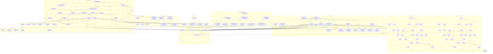

# CodeSleuth — Component 0 — Lobby_prettify_prettify

_Auto-generated by [CodeSleuth](https://github.com/codesleuth)._

```mermaid
%%{init: {"theme": "default", "maxTextSize": 200000, "flowchart": {"useMaxWidth": true}}}%%
flowchart TD
    subgraph sg_Lobby_b6f7a3["client/src/components/Lobby.tsx"]
        n0["<b>fetchStats</b><br/><i>Lobby.tsx:26</i>"]
    end
    subgraph sg_prettify_c59816["server/coverage/lcov-report/prettify.js"]
        n1["<b>k</b><br/><i>prettify.js:2</i>"]
        n2["<b>k.ab</b><br/><i>prettify.js:2</i>"]
        n3["<b>k.T</b><br/><i>prettify.js:2</i>"]
        n4["<b>k.X</b><br/><i>prettify.js:2</i>"]
        n5["<b>k.W</b><br/><i>prettify.js:2</i>"]
        n6["<b>a</b><br/><i>prettify.js:2</i>"]
        n7["<b>a.aa</b><br/><i>prettify.js:2</i>"]
        n8["<b>B</b><br/><i>prettify.js:2</i>"]
        n9["<b>o</b><br/><i>prettify.js:2</i>"]
        n10["<b>g</b><br/><i>prettify.js:2</i>"]
        n11["<b>g.W</b><br/><i>prettify.js:2</i>"]
        n12["<b>i</b><br/><i>prettify.js:2</i>"]
        n13["<b>Q</b><br/><i>prettify.js:2</i>"]
        n14["<b>Q.ae</b><br/><i>prettify.js:2</i>"]
        n15["<b>Q.ad</b><br/><i>prettify.js:2</i>"]
        n16["<b>ad.ai</b><br/><i>prettify.js:2</i>"]
        n17["<b>D</b><br/><i>prettify.js:2</i>"]
        n18["<b>c</b><br/><i>prettify.js:2</i>"]
        n19["<b>q</b><br/><i>prettify.js:2</i>"]
        n20["<b>d</b><br/><i>prettify.js:2</i>"]
        n21["<b>y</b><br/><i>prettify.js:2</i>"]
        n22["<b>b</b><br/><i>prettify.js:2</i>"]
        n23["<b>b.Y</b><br/><i>prettify.js:2</i>"]
        n24["<b>b.U</b><br/><i>prettify.js:2</i>"]
    end
    subgraph sg_prettify_bdb0bf["server/coverage/prettify.js"]
        n25["<b>k</b><br/><i>prettify.js:2</i>"]
        n26["<b>k.ab</b><br/><i>prettify.js:2</i>"]
        n27["<b>k.T</b><br/><i>prettify.js:2</i>"]
        n28["<b>k.X</b><br/><i>prettify.js:2</i>"]
        n29["<b>k.W</b><br/><i>prettify.js:2</i>"]
        n30["<b>a</b><br/><i>prettify.js:2</i>"]
        n31["<b>a.aa</b><br/><i>prettify.js:2</i>"]
        n32["<b>B</b><br/><i>prettify.js:2</i>"]
        n33["<b>o</b><br/><i>prettify.js:2</i>"]
        n34["<b>g</b><br/><i>prettify.js:2</i>"]
        n35["<b>g.W</b><br/><i>prettify.js:2</i>"]
        n36["<b>i</b><br/><i>prettify.js:2</i>"]
        n37["<b>Q</b><br/><i>prettify.js:2</i>"]
        n38["<b>Q.ae</b><br/><i>prettify.js:2</i>"]
        n39["<b>Q.ad</b><br/><i>prettify.js:2</i>"]
        n40["<b>ad.ai</b><br/><i>prettify.js:2</i>"]
        n41["<b>D</b><br/><i>prettify.js:2</i>"]
        n42["<b>c</b><br/><i>prettify.js:2</i>"]
        n43["<b>q</b><br/><i>prettify.js:2</i>"]
        n44["<b>d</b><br/><i>prettify.js:2</i>"]
        n45["<b>y</b><br/><i>prettify.js:2</i>"]
        n46["<b>b</b><br/><i>prettify.js:2</i>"]
        n47["<b>b.Y</b><br/><i>prettify.js:2</i>"]
        n48["<b>b.U</b><br/><i>prettify.js:2</i>"]
    end
    subgraph sg_BotPlayer_cbe01d["server/src/classes/BotPlayer.ts"]
        n49["<b>BotPlayer.fromPlayer</b><br/><i>BotPlayer.ts:22</i><br/><i>Create a BotPlayer from an existing Player (for takeover scenarios)</i>"]
        n50["<b>BotPlayer.decideBid</b><br/><i>BotPlayer.ts:38</i><br/><i>Decide what to bid during bidding phase.</i>"]
        n51["<b>BotPlayer.decideTrump</b><br/><i>BotPlayer.ts:55</i><br/><i>Decide trump suit and friend cards during trump selection.</i>"]
        n52["<b>BotPlayer.decideCard</b><br/><i>BotPlayer.ts:118</i><br/><i>Decide which card to play during playing phase.</i>"]
        n53["<b>BotPlayer.calculateHandStrength</b><br/><i>BotPlayer.ts:170</i><br/><i>Calculate a rough &quot;strength&quot; score for the hand.</i>"]
    end
    subgraph sg_Card_9aef93["server/src/classes/Card.ts"]
        n54["<b>Card.toString</b><br/><i>Card.ts:30</i>"]
    end
    subgraph sg_Deck_6b4fc2["server/src/classes/Deck.ts"]
        n55["<b>Deck.constructor</b><br/><i>Deck.ts:7</i>"]
        n56["<b>Deck.reset</b><br/><i>Deck.ts:11</i>"]
        n57["<b>Deck.shuffle</b><br/><i>Deck.ts:23</i>"]
        n58["<b>Deck.deal</b><br/><i>Deck.ts:30</i>"]
    end
    subgraph sg_Game_eb2f2c["server/src/classes/Game.ts"]
        n59["<b>Game.constructor</b><br/><i>Game.ts:29</i>"]
        n60["<b>Game.isPlayerDisconnectedOrBot</b><br/><i>Game.ts:37</i>"]
        n61["<b>Game.checkAndTriggerBot</b><br/><i>Game.ts:42</i>"]
        n62["<b>Game.botTakeTurn</b><br/><i>Game.ts:62</i>"]
        n63["<b>Game.getInitialState</b><br/><i>Game.ts:100</i>"]
        n64["<b>Game.addPlayer</b><br/><i>Game.ts:114</i>"]
        n65["<b>Game.removePlayer</b><br/><i>Game.ts:174</i>"]
        n66["<b>Game.resetGameState</b><br/><i>Game.ts:203</i>"]
        n67["<b>Game.startGame</b><br/><i>Game.ts:220</i>"]
        n68["<b>Game.handleBid</b><br/><i>Game.ts:264</i>"]
        n69["<b>Game.handleSelectTrumpAndFriends</b><br/><i>Game.ts:312</i>"]
        n70["<b>Game.dealRemainingCards</b><br/><i>Game.ts:357</i>"]
        n71["<b>Game.assignTeams</b><br/><i>Game.ts:374</i>"]
        n72["<b>Game.advanceTurn</b><br/><i>Game.ts:397</i>"]
        n73["<b>Game.handlePlayCard</b><br/><i>Game.ts:405</i>"]
        n74["<b>Game.isValidMove</b><br/><i>Game.ts:436</i>"]
        n75["<b>Game.resolveTrick</b><br/><i>Game.ts:453</i>"]
        n76["<b>Game.endGame</b><br/><i>Game.ts:513</i>"]
        n77["<b>Game.broadcastState</b><br/><i>Game.ts:560</i>"]
    end
    subgraph sg_Player_485055["server/src/classes/Player.ts"]
        n78["<b>Player.addCards</b><br/><i>Player.ts:17</i>"]
        n79["<b>Player.removeCard</b><br/><i>Player.ts:22</i>"]
        n80["<b>Player.hasSuit</b><br/><i>Player.ts:29</i>"]
        n81["<b>Player.sortHand</b><br/><i>Player.ts:33</i>"]
        n82["<b>Player.hasFaceCard</b><br/><i>Player.ts:41</i>"]
    end
    subgraph sg_Room_9465b6["server/src/classes/Room.ts"]
        n83["<b>Room.constructor</b><br/><i>Room.ts:40</i>"]
        n84["<b>Room.getGame</b><br/><i>Room.ts:57</i><br/><i>Get the underlying game instance</i>"]
        n85["<b>Room.getPlayerCount</b><br/><i>Room.ts:71</i><br/><i>Get player count</i>"]
        n86["<b>Room.isNameTaken</b><br/><i>Room.ts:78</i><br/><i>Check if a player name is already taken in this room</i>"]
        n87["<b>Room.isIPInRoom</b><br/><i>Room.ts:87</i><br/><i>Check if an IP is already in use in this room</i>"]
        n88["<b>Room.isFull</b><br/><i>Room.ts:100</i><br/><i>Check if the room is full</i>"]
        n89["<b>Room.isGameInProgress</b><br/><i>Room.ts:107</i><br/><i>Check if a game is in progress</i>"]
        n90["<b>Room.addPlayer</b><br/><i>Room.ts:114</i><br/><i>Add a player to the room</i>"]
        n91["<b>Room.removePlayer</b><br/><i>Room.ts:190</i><br/><i>Remove a player from the room</i>"]
        n92["<b>Room.isEmpty</b><br/><i>Room.ts:217</i><br/><i>Check if the room is empty</i>"]
        n93["<b>Room.startGame</b><br/><i>Room.ts:226</i><br/><i>Start the game</i>"]
        n94["<b>Room.isBot</b><br/><i>Room.ts:269</i><br/><i>Check if a player ID belongs to a bot</i>"]
        n95["<b>Room.getBots</b><br/><i>Room.ts:276</i><br/><i>Get all bots in the room</i>"]
        n96["<b>Room.addBot</b><br/><i>Room.ts:283</i><br/><i>Add a bot to the room (host only)</i>"]
        n97["<b>Room.removeBot</b><br/><i>Room.ts:336</i><br/><i>Remove a bot from the room (host only)</i>"]
        n98["<b>Room.exitAndReplaceWithBot</b><br/><i>Room.ts:387</i><br/><i>Allow a player to exit mid-game and be replaced with a bot.</i>"]
    end
    subgraph sg_RoomManager_147fe6["server/src/classes/RoomManager.ts"]
        n99["<b>RoomManager.constructor</b><br/><i>RoomManager.ts:20</i>"]
        n100["<b>RoomManager.startCleanupTimer</b><br/><i>RoomManager.ts:31</i><br/><i>Start the periodic room cleanup timer</i>"]
        n101["<b>RoomManager.stopCleanupTimer</b><br/><i>RoomManager.ts:44</i><br/><i>Stop the cleanup timer (for graceful shutdown)</i>"]
        n102["<b>RoomManager.createRoom</b><br/><i>RoomManager.ts:55</i><br/><i>Create a new room with a unique code</i>"]
        n103["<b>RoomManager.getRoom</b><br/><i>RoomManager.ts:83</i><br/><i>Get a room by its code</i>"]
        n104["<b>RoomManager.deleteRoom</b><br/><i>RoomManager.ts:97</i><br/><i>Delete a room</i>"]
        n105["<b>RoomManager.getTotalPlayerCount</b><br/><i>RoomManager.ts:127</i><br/><i>Get total number of players across all rooms</i>"]
        n106["<b>RoomManager.cleanupInactiveRooms</b><br/><i>RoomManager.ts:138</i><br/><i>Clean up inactive and empty rooms</i>"]
        n107["<b>RoomManager.joinRoom</b><br/><i>RoomManager.ts:167</i><br/><i>Join a room with validation</i>"]
        n108["<b>RoomManager.getStats</b><br/><i>RoomManager.ts:195</i><br/><i>Get statistics about all rooms</i>"]
    end
    subgraph sg_index_f1e6aa["server/src/index.ts"]
        n109["<b>getSocketRoom</b><br/><i>index.ts:73</i>"]
    end
    subgraph sg_CodeGenerator_b8d8d5["server/src/services/CodeGenerator.ts"]
        n110["<b>generateRoomCode</b><br/><i>CodeGenerator.ts:16</i>"]
        n111["<b>isValidRoomCode</b><br/><i>CodeGenerator.ts:31</i>"]
    end
    subgraph sg_Logger_a2dba5["server/src/services/Logger.ts"]
        n112["<b>Logger.log</b><br/><i>Logger.ts:110</i>"]
        n113["<b>Logger.debug</b><br/><i>Logger.ts:114</i>"]
        n114["<b>Logger.info</b><br/><i>Logger.ts:118</i>"]
        n115["<b>Logger.warn</b><br/><i>Logger.ts:122</i>"]
        n116["<b>Logger.error</b><br/><i>Logger.ts:126</i>"]
        n117["<b>Logger.playerAction</b><br/><i>Logger.ts:146</i><br/><i>Log a player action (bid, play card, etc.)</i>"]
        n118["<b>Logger.phaseChange</b><br/><i>Logger.ts:158</i><br/><i>Log a game state transition</i>"]
        n119["<b>Logger.botAction</b><br/><i>Logger.ts:169</i><br/><i>Log a bot action</i>"]
        n120["<b>Logger.socketEvent</b><br/><i>Logger.ts:181</i><br/><i>Log a socket event</i>"]
    end
    n0 -->|L38| n112
    n3 -->|L2| n54
    n4 -->|L2| n2
    n4 -->|L2| n2
    n4 -->|L2| n3
    n4 -->|L2| n3
    n5 -->|L2| n4
    n1 -->|L2| n5
    n7 -->|L2| n7
    n6 -->|L2| n7
    n8 -->|L2| n5
    n10 -->|L2| n1
    n11 -->|L2| n8
    n11 -->|L2| n8
    n11 -->|L2| n19
    n11 -->|L2| n8
    n12 -->|L2| n10
    n14 -->|L2| n15
    n14 -->|L2| n14
    n14 -->|L2| n15
    n16 -->|L2| n16
    n15 -->|L2| n16
    n13 -->|L2| n14
    n18 -->|L2| n115
    n20 -->|L2| n6
    n20 -->|L2| n19
    n20 -->|L2| n17
    n20 -->|L2| n112
    n21 -->|L2| n13
    n21 -->|L2| n20
    n22 -->|L2| n23
    n22 -->|L2| n23
    n22 -->|L2| n23
    n24 -->|L2| n9
    n24 -->|L2| n13
    n24 -->|L2| n20
    n24 -->|L2| n15
    n22 -->|L2| n24
    n27 -->|L2| n54
    n28 -->|L2| n26
    n28 -->|L2| n26
    n28 -->|L2| n27
    n28 -->|L2| n27
    n29 -->|L2| n28
    n25 -->|L2| n29
    n31 -->|L2| n31
    n30 -->|L2| n31
    n32 -->|L2| n29
    n34 -->|L2| n25
    n35 -->|L2| n32
    n35 -->|L2| n32
    n35 -->|L2| n43
    n35 -->|L2| n32
    n36 -->|L2| n34
    n38 -->|L2| n39
    n38 -->|L2| n38
    n38 -->|L2| n39
    n40 -->|L2| n40
    n39 -->|L2| n40
    n37 -->|L2| n38
    n42 -->|L2| n115
    n44 -->|L2| n30
    n44 -->|L2| n43
    n44 -->|L2| n41
    n44 -->|L2| n112
    n45 -->|L2| n37
    n45 -->|L2| n44
    n46 -->|L2| n47
    n46 -->|L2| n47
    n46 -->|L2| n47
    n48 -->|L2| n33
    n48 -->|L2| n37
    n48 -->|L2| n44
    n48 -->|L2| n39
    n46 -->|L2| n48
    n50 -->|L41| n113
    n50 -->|L43| n53
    n51 -->|L98| n113
    n52 -->|L120| n115
    n52 -->|L154| n113
    n55 -->|L8| n56
    n59 -->|L32| n63
    n61 -->|L48| n60
    n61 -->|L49| n119
    n61 -->|L56| n62
    n62 -->|L64| n49
    n62 -->|L68| n50
    n62 -->|L69| n119
    n62 -->|L71| n68
    n62 -->|L75| n51
    n62 -->|L76| n119
    n62 -->|L81| n69
    n62 -->|L85| n52
    n62 -->|L87| n119
    n62 -->|L93| n73
    n64 -->|L154| n114
    n64 -->|L162| n77
    n64 -->|L170| n77
    n65 -->|L180| n114
    n65 -->|L192| n114
    n65 -->|L200| n77
    n66 -->|L214| n63
    n67 -->|L226| n115
    n67 -->|L231| n66
    n67 -->|L232| n56
    n67 -->|L233| n57
    n67 -->|L237| n78
    n67 -->|L237| n58
    n67 -->|L241| n82
    n67 -->|L244| n67
    n67 -->|L251| n118
    n67 -->|L252| n114
    n67 -->|L258| n77
    n67 -->|L261| n61
    n68 -->|L278| n118
    n68 -->|L279| n114
    n68 -->|L285| n77
    n68 -->|L290| n67
    n68 -->|L306| n77
    n68 -->|L309| n61
    n69 -->|L329| n70
    n69 -->|L336| n71
    n69 -->|L343| n118
    n69 -->|L344| n114
    n69 -->|L351| n77
    n69 -->|L354| n61
    n70 -->|L360| n78
    n70 -->|L360| n58
    n70 -->|L364| n82
    n70 -->|L368| n67
    n72 -->|L399| n77
    n72 -->|L402| n61
    n73 -->|L416| n74
    n73 -->|L422| n79
    n73 -->|L429| n75
    n73 -->|L432| n72
    n74 -->|L448| n80
    n75 -->|L490| n77
    n75 -->|L503| n76
    n75 -->|L505| n77
    n75 -->|L508| n61
    n76 -->|L540| n118
    n76 -->|L541| n114
    n76 -->|L557| n77
    n78 -->|L19| n81
    n83 -->|L51| n114
    n90 -->|L118| n89
    n90 -->|L120| n90
    n90 -->|L123| n114
    n90 -->|L127| n85
    n90 -->|L136| n88
    n90 -->|L137| n115
    n90 -->|L144| n86
    n90 -->|L145| n115
    n90 -->|L152| n87
    n90 -->|L153| n115
    n90 -->|L160| n90
    n90 -->|L168| n114
    n90 -->|L172| n85
    n90 -->|L175| n114
    n90 -->|L179| n85
    n91 -->|L195| n91
    n91 -->|L201| n114
    n91 -->|L207| n114
    n91 -->|L210| n85
    n93 -->|L231| n115
    n93 -->|L239| n115
    n93 -->|L246| n93
    n95 -->|L277| n94
    n96 -->|L288| n115
    n96 -->|L293| n89
    n96 -->|L294| n115
    n96 -->|L299| n88
    n96 -->|L300| n115
    n96 -->|L306| n115
    n96 -->|L316| n90
    n96 -->|L320| n114
    n96 -->|L323| n85
    n97 -->|L341| n115
    n97 -->|L346| n89
    n97 -->|L347| n115
    n97 -->|L352| n94
    n97 -->|L353| n115
    n97 -->|L360| n115
    n97 -->|L365| n91
    n97 -->|L374| n114
    n97 -->|L377| n85
    n98 -->|L391| n89
    n98 -->|L402| n94
    n98 -->|L441| n114
    n98 -->|L452| n115
    n99 -->|L25| n100
    n100 -->|L33| n106
    n100 -->|L36| n114
    n101 -->|L48| n114
    n102 -->|L61| n110
    n102 -->|L72| n114
    n104 -->|L101| n114
    n105 -->|L130| n85
    n106 -->|L146| n92
    n106 -->|L149| n114
    n106 -->|L157| n114
    n107 -->|L168| n111
    n107 -->|L174| n103
    n107 -->|L177| n115
    n108 -->|L198| n105
    n108 -->|L205| n85
    n108 -->|L206| n84
    n109 -->|L75| n103
    n112 -->|L111| n112
    n113 -->|L115| n112
    n114 -->|L119| n112
    n115 -->|L123| n112
    n116 -->|L128| n112
    n116 -->|L137| n112
    n117 -->|L147| n114
    n118 -->|L159| n114
    n119 -->|L170| n114
    n120 -->|L183| n113
```
