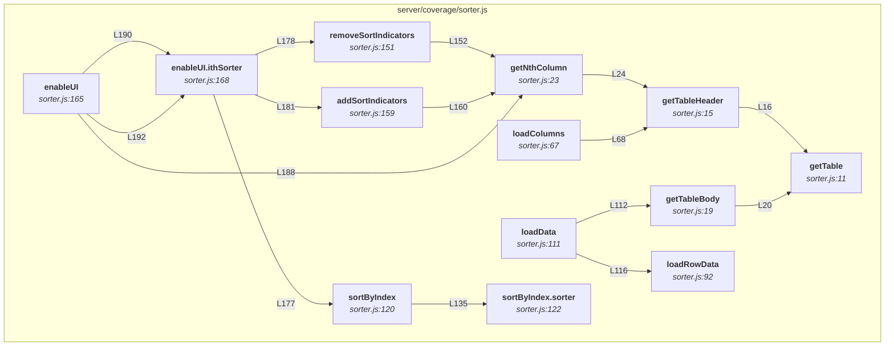

# CodeSleuth — Component 2 — sorter

_Auto-generated by [CodeSleuth](https://github.com/codesleuth)._

```mermaid
%%{init: {"theme": "default", "maxTextSize": 200000, "flowchart": {"useMaxWidth": true}}}%%
flowchart TD
    subgraph sg_sorter_e6de2c["server/coverage/sorter.js"]
        n0["<b>getTable</b><br/><i>sorter.js:11</i>"]
        n1["<b>getTableHeader</b><br/><i>sorter.js:15</i>"]
        n2["<b>getTableBody</b><br/><i>sorter.js:19</i>"]
        n3["<b>getNthColumn</b><br/><i>sorter.js:23</i>"]
        n4["<b>loadColumns</b><br/><i>sorter.js:67</i>"]
        n5["<b>loadRowData</b><br/><i>sorter.js:92</i>"]
        n6["<b>loadData</b><br/><i>sorter.js:111</i>"]
        n7["<b>sortByIndex</b><br/><i>sorter.js:120</i>"]
        n8["<b>sortByIndex.sorter</b><br/><i>sorter.js:122</i>"]
        n9["<b>removeSortIndicators</b><br/><i>sorter.js:151</i>"]
        n10["<b>addSortIndicators</b><br/><i>sorter.js:159</i>"]
        n11["<b>enableUI</b><br/><i>sorter.js:165</i>"]
        n12["<b>enableUI.ithSorter</b><br/><i>sorter.js:168</i>"]
    end
    n1 -->|L16| n0
    n2 -->|L20| n0
    n3 -->|L24| n1
    n4 -->|L68| n1
    n6 -->|L112| n2
    n6 -->|L116| n5
    n7 -->|L135| n8
    n9 -->|L152| n3
    n10 -->|L160| n3
    n12 -->|L177| n7
    n12 -->|L178| n9
    n12 -->|L181| n10
    n11 -->|L188| n3
    n11 -->|L190| n12
    n11 -->|L192| n12
```
