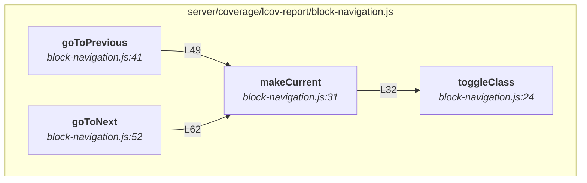

# CodeSleuth — Component 4 — block-navigation

_Auto-generated by [CodeSleuth](https://github.com/codesleuth)._

```mermaid
%%{init: {"theme": "default", "maxTextSize": 200000, "flowchart": {"useMaxWidth": true}}}%%
flowchart TD
    subgraph sg_block_navigation_38ef1b["server/coverage/lcov-report/block-navigation.js"]
        n0["<b>toggleClass</b><br/><i>block-navigation.js:24</i>"]
        n1["<b>makeCurrent</b><br/><i>block-navigation.js:31</i>"]
        n2["<b>goToPrevious</b><br/><i>block-navigation.js:41</i>"]
        n3["<b>goToNext</b><br/><i>block-navigation.js:52</i>"]
    end
    n1 -->|L32| n0
    n2 -->|L49| n1
    n3 -->|L62| n1
```
