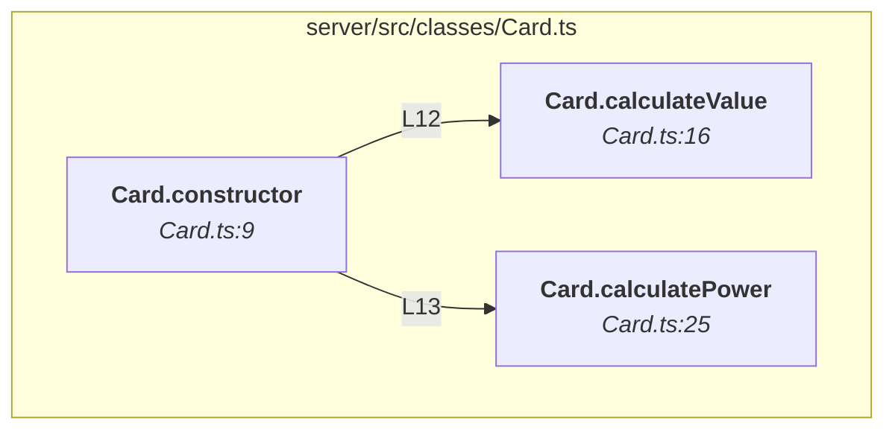

# CodeSleuth — Component 5 — Card

_Auto-generated by [CodeSleuth](https://github.com/codesleuth)._

```mermaid
%%{init: {"theme": "default", "maxTextSize": 200000, "flowchart": {"useMaxWidth": true}}}%%
flowchart TD
    subgraph sg_Card_9aef93["server/src/classes/Card.ts"]
        n0["<b>Card.constructor</b><br/><i>Card.ts:9</i>"]
        n1["<b>Card.calculateValue</b><br/><i>Card.ts:16</i>"]
        n2["<b>Card.calculatePower</b><br/><i>Card.ts:25</i>"]
    end
    n0 -->|L12| n1
    n0 -->|L13| n2
```
