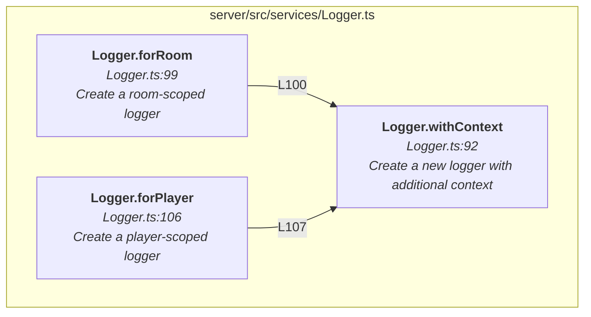

# CodeSleuth — Component 6 — Logger

_Auto-generated by [CodeSleuth](https://github.com/codesleuth)._

```mermaid
%%{init: {"theme": "default", "maxTextSize": 200000, "flowchart": {"useMaxWidth": true}}}%%
flowchart TD
    subgraph sg_Logger_a2dba5["server/src/services/Logger.ts"]
        n0["<b>Logger.withContext</b><br/><i>Logger.ts:92</i><br/><i>Create a new logger with additional context</i>"]
        n1["<b>Logger.forRoom</b><br/><i>Logger.ts:99</i><br/><i>Create a room-scoped logger</i>"]
        n2["<b>Logger.forPlayer</b><br/><i>Logger.ts:106</i><br/><i>Create a player-scoped logger</i>"]
    end
    n1 -->|L100| n0
    n2 -->|L107| n0
```
