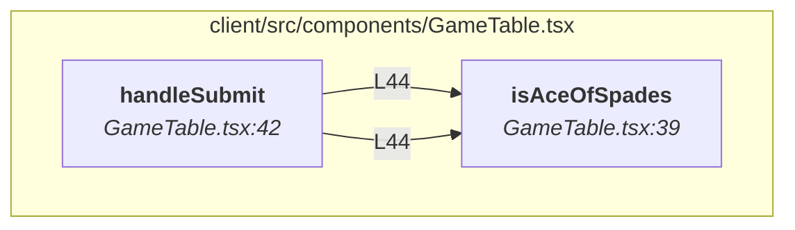

# CodeSleuth — Component 7 — GameTable

_Auto-generated by [CodeSleuth](https://github.com/codesleuth)._

```mermaid
%%{init: {"theme": "default", "maxTextSize": 200000, "flowchart": {"useMaxWidth": true}}}%%
flowchart TD
    subgraph sg_GameTable_17b9e7["client/src/components/GameTable.tsx"]
        n0["<b>isAceOfSpades</b><br/><i>GameTable.tsx:39</i>"]
        n1["<b>handleSubmit</b><br/><i>GameTable.tsx:42</i>"]
    end
    n1 -->|L44| n0
    n1 -->|L44| n0
```
